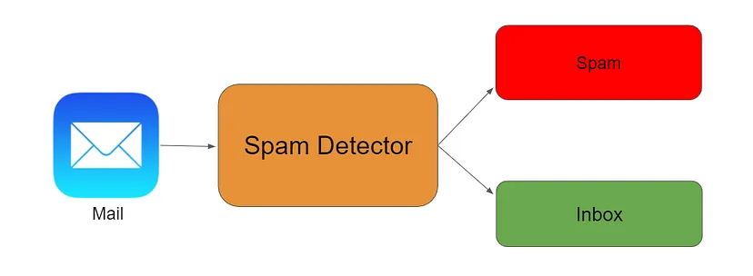

# Email Spam Ham Detection
## Phase 2 Task 1 

> To develop an efficient and accurate Email Spam Detection system

Image Source : https://towardsdatascience.com/spam-detection-in-emails-de0398ea3b48

## - [Google Colab File link](https://colab.research.google.com/drive/1-67V8P6bruw-8dfjGoc0ZKD10u4q4JyK?usp=sharing)
---
 

## Project Overview / Problem Statement

**In the contemporary digital landscape, the exponential increase in email communication has led to a surge in the volume of unwanted and potentially harmful messages, commonly known as spam. Email users are inundated with unsolicited emails that can range from mere nuisances to serious security threats. To address this issue and enhance the email experience, the goal is to develop an efficient and accurate Email Spam Detection system.**

**Key Deliverables:**

- Spam Detection Model:
    - Implement a machine learning or deep learning-based model capable of accurately classifying emails as either spam or non-spam (ham).
    - Train the model on a diverse dataset that includes a representative sample of both spam and non-spam emails.
    - Evaluate the model's performance using metrics such as precision, recall, F1-score, and accuracy.

- Detection: 
    - Minimize false positives to prevent legitimate emails from being incorrectly classified as spam.

**Goals** :
- High Accuracy:

    - Achieve a high level of accuracy in spam detection to minimize false positives and false negatives, ensuring an efficient and reliable system.

## Data Source

The dataset used in this project was obtained from Kaggle, a popular platform for data science and machine learning enthusiasts. Below, you will find details about the dataset and a link to the original source:

- **Dataset Name:** Spam Mails Dataset
- **Kaggle Dataset Link:** https://www.kaggle.com/datasets/venky73/spam-mails-dataset
- **Dataset Description:**  It contains two types classes of spam and ham. 

## Codes and Resources Used

- **Editor Used:**  Google Colab
- **Python Version:** 3.10.12

## Conclusion

**A breakdown of the key metrics in the classification:**

- Precision: Precision is the ratio of correctly predicted positive observations to the total predicted positives. For class 0, it's 0.98, and for class 1, it's 0.96. High precision relates to the low false positive rate.

- Recall (Sensitivity): Recall is the ratio of correctly predicted positive observations to the all observations in the actual class. For class 0, it's 0.98, and for class 1, it's 0.96. High recall relates to the low false negative rate.

- F1-Score: The F1-Score is the weighted average of precision and recall. It ranges from 0 to 1, where 1 is the best possible F1-Score. For class 0, it's 0.98, and for class 1, it's 0.96.

- Support: Support is the number of actual occurrences of the class in the specified dataset. For class 0, it's 744, and for class 1, it's 291.

- Accuracy: The overall accuracy of the model is 0.9758 or 97.58%, indicating the proportion of correctly classified instances out of the total instances.

- Overall, the model is performing well, with high precision, recall, and accuracy.
---

## Author

- [Apoorva](https://www.linkedin.com/in/apoorva29501/)

---

## Reference
 - [CodersCave Data Science Internship](https://www.linkedin.com/company/codersscave/)
