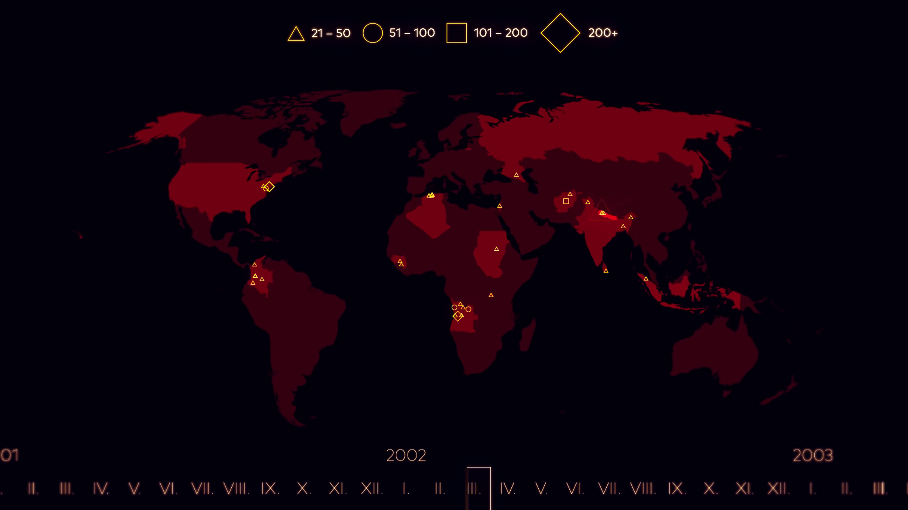

# Exploratory Data Analysis - Terrorism

> Perform Exploratory Data Analysis (EDA) on the terrorism dataset

Image Source : https://www.youtube.com/watch?v=cHbYk2l9w-E

## - [Google Colab File link](https://colab.research.google.com/drive/1X1yDkKw-QM-gpz63iNWKfY9b9x3FCrbX?usp=sharing)
---
 

## Project Overview / Problem Statement

**The objective of this project is to conduct a comprehensive Exploratory Data Analysis (EDA) on a terrorism dataset, with the goal of extracting valuable insights and patterns. Through the dataset, primary objectives are to uncover, analyze, and interpret various trends, identify regions at high risk for terrorist activities, delve into the characteristics of these attacks, and potentially discern underlying factors that contribute to the prevalence of terrorism.**

**Trend Identification**: The project aims to identify and elucidate long-term and short-term trends in terrorism, encompassing aspects such as the frequency, magnitude, and geographical distribution of attacks. By discerning these trends, we can better comprehend the evolving nature of terrorism.

**High-Risk Region Analysis**: A critical aspect of the project is the identification of regions that are particularly susceptible to terrorist activities. This analysis will provide actionable insights for policymakers and security agencies to allocate resources and focus their efforts effectively.

**Attack Characteristics**: We will delve into the characteristics of terrorist attacks, including their methods, targets, and outcomes. By doing so, we aim to uncover patterns that can help in developing strategies to counteract such attacks and minimize their impact.

**Factors Contributing to Terrorism**: Beyond the surface-level analysis, we seek to explore the underlying factors contributing to the prevalence of terrorism. This might include social, economic, political, or cultural factors that could be associated with the occurrence of terrorist incidents.

## Data Source

The dataset used in this project was obtained from Kaggle, a popular platform for data science and machine learning enthusiasts. Below, you will find details about the dataset and a link to the original source:

- **Dataset Name:** Global Terrorism Database
- **Kaggle Dataset Link:** https://www.kaggle.com/datasets/START-UMD/gtd
- **Dataset Description:** The Global Terrorism Database (GTD) is an open-source database including information on terrorist attacks around the world from 1970 through 2017. The GTD includes systematic data on more than 180,000 attacks. The database is maintained by researchers at the National Consortium for the Study of Terrorism and Responses to Terrorism (START), headquartered at the University of Maryland.

## Codes and Resources Used

- **Editor Used:**  Google Colab
- **Python Version:** 3.10.12

## Conclusion
Exploratory Data Analysis (EDA) Conclusion:

1. **Regional Targeting**: The EDA reveals that the Taliban has a significant regional impact, with Helmand, Kandahar, and Ghazni being the most targeted regions. This underscores the localized nature of their operations within Afghanistan.

2. **Vulnerable Regions**: Other regions like Farah, Nangarhar, Faryab, and Kabul are also highly vulnerable to Taliban attacks, emphasizing the widespread threat across the country.

3. **Global Reach**: The data shows that the terroist's activities extend beyond Afghanistan, with countries like Pakistan, India, the United States, and Nepal experiencing their attacks, indicating a cross-border presence.

4. **International Impact**: Russia, the United Kingdom, Iraq, Saudi Arabia, and Bangladesh feature in the top 10 list, demonstrating the global reach of the Taliban and the diverse regions affected by their extremist activities.

5. **Counterterrorism Focus**: Identifying the Taliban as the primary threat suggests the need for focused counterterrorism strategies to combat their activities effectively.

6. **Terrorism Effectiveness**: The data shows a higher number of successful terrorist incidents compared to failures, indicating a concerning level of effectiveness in carrying out attacks.

7. **Regional Trends**: The line chart underscores the persistent threat in the Middle East, North Africa, and South Asia, highlighting the need for region-specific counterterrorism efforts.

8. **Stable Regions**: On the other hand, regions like Australasia & Oceania, Central Asia, and North America, South America maintain low and stable levels of terrorism, suggesting different security dynamics.

9. **Diverse Attack Types**: The word cloud analysis reveals that bombings and explosions are prevalent, but there is a diverse range of attack types in different countries, emphasizing the need for tailored counterterrorism strategies.

---

## Author

- [Apoorva](https://www.linkedin.com/in/apoorva29501/)

---

## Reference
 - [CodersCave Data Science Internship](https://www.linkedin.com/company/codersscave/)
